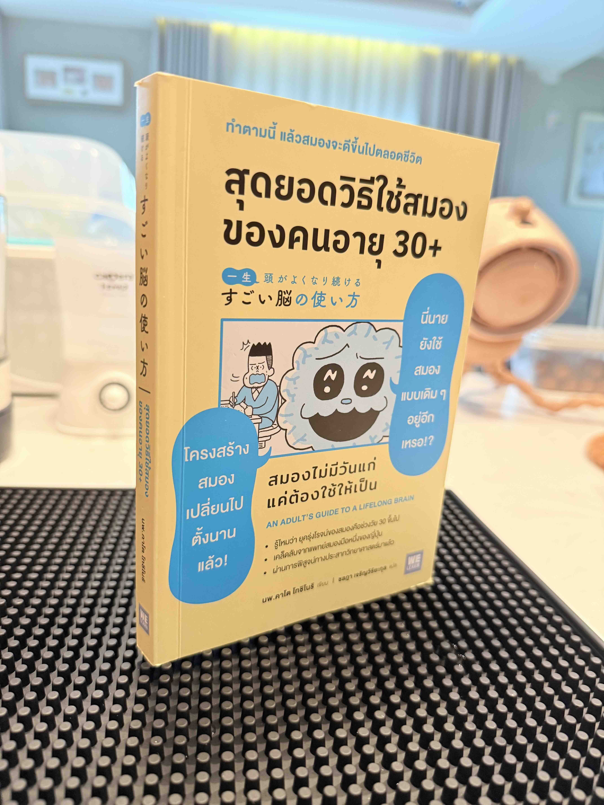

ถึงอายุมาก แต่สมองยังไม่หยุดพัฒนา ใช้ให้ถูกวิธีตามแต่ละช่วงวัย เพิ่มประสิทธิภาพสมอง ด้วยการสรุปสิ่งที่เรียนรู้ให้แมวฟัง!!!!

- สมองผู้ใหญ่ทำงานไม่เหมือนสมองวัยรุ่น
- ต้องเปลี่ยนวิธีเรียนรู้ให้เหมาะสมกับอายุสมอง
- กลไกการทำงานของสมองเปลี่ยน วิธีใช้งานต้องเปลี่ยน
- ยุคทองของสมองคือช่วงวัย 45-55
- วิธีเรียนแบบท่องจำ ไม่เหมาะกับสมองผู้ใหญ่
<!-- truncate -->
- บริหารสมองส่วนความเข้าใจด้วยการเปลี่ยนแปลงสภาพแวดล้อมเดิม
- เช่น จัดห้องใหม่ แปรงฟันด้วยมือข้างที่ไม่ถนัด
- ให้เคลื่อนไหวร่างกายเวลาสมองไม่แล่น
- สมองส่วนการมองเห็นแข็งแกร่ง -> ถนัดใช้ตาดูข้อมูล
- สมองส่วนการได้ยินแข็งแกร่ง -> ถนัดใช้หูฟังข้อมูล
- เครือข่ายสมองที่ใช้บ่อยเปรียบเหมือนทางด่วน
- เพราะประมวลผลเร็วและไม่เครียด
- แต่ถ้าใช้งานทางด่วนบ่อยจะลืมไปว่ามีทางธรรมดาอยู่
- และทางด่วนจะทรุดโทรมจน Speed ตก
- สุดท้่าย ทางธรรมดาก็ลืม ทางด่วนก็ทรุดโทรม
- เวลาอยากจำอะไรซักอย่าง วิธีที่ถูกต้องคือ **"ทำความเข้าใจ"** ไม่ใช่ **"ท่องจำ"**
- อายุมากขึ้น เซลล์สมองลดลงแต่เครือข่ายใยประสาทดีขึ้น
- ใส่อารมณ์ ความรู้สึกลงไปในการเรียนรู้ ประสิทธิภาพความจำจะเพิ่มขึ้นอย่างรวดเร็ว
- ให้เรียนรู้ขณะสมองมีความสุข รู้สึกสนุก
- ทำความเข้าใจจนร้อง "อ๋อ อย่างนี้นี้เอง!"
- เรียนรู้โดยใช้สมองส่วนความเข้าใจ ทำความเข้าใจความรู้นั้นๆ
- สร้างแรงจูงใจในการค้นคว้าหาความรู้ด้วยตนเอง
- จะเป็นแรงผลักดันให้เราทำความเข้าใจอย่างลึกซึ้ง
- สมองผู้ใหญ่ **จำได้ด้วยความเข้าใจ** ไม่ใช่ท่องจำ
- ทำให้สมองคิดว่านี่คือข้อมูลสำคัญโดย ส่วนข้อมูลเดิมซ้ำๆ ไปยัง **ฮิปโปแคมปัส**
- การทบทวนเป็นกุญแจสำคัญของการเรียนรู้
- การเรียนรู้และทบทวนภายในวันเดียวกัน จะทำให้จำแม่นขึ้น
- อ่านออกเสียงสิ่งที่ทำสรุปไว้ในสมุดโน๊ต ทำให้จำได้ดีขึ้น
- เรียนรู้วันละ 10 นาที 12 วัน มีประสิทธิภาพมากกว่ารวดเดียว 2 ชั่วโมง
- สร้างความคุ้นเคย, ต่อเนื่อง ในการเรียนรู้ของสมอง
- เมื่อเริ่มเรียนรู้สิ่งใหม่ จำเป็นต้องใช้เวลา 75 ชั่วโมง เพื่อให้สมองทำงานราบรื่น
- เวลา 75 ชั่วโมง คำนวนมาจาก 12 ชั่วโมง ต่อเนื่อง 5 วัน
- ให้นึกถึง Output ระหว่าง Input
- ยิ่งสอน ยิ่งได้เรียนรู้ การอธิบายสิ่งที่ได้เรียนรู้ให้คนอื่นฟัง จะทำให้เราเข้าใจได้มากขึ้น
- 80% ของผู้หญิงถนัดพัง 60% ของผู้ชายถนัดดู
- แต่ละคนจะมีวิธีเรียนรู้ที่เหมาะสมกับตัวเอง
- ไม่ว่าจะถนัดดูหรือฟังก็ต้องฝึกสมองส่วนการได้ยินด้วยการอ่านออกเสียง
- การอ่านออกเสียงใช้งานทั้งสมองส่วนการมองเห็น สมองส่วนการสื่อสาร, สมองส่วนการเคลื่อนไหว และสมองส่วนการได้ยิน
- ยิ่งสมองทำงานพร้อมกันหลายส่วน ประสิทธิภาพโดยรวมของสมองยิ่งเพิ่มขึ้น
- กระตุ้นให้สมองหลายส่วนทำงานพร้อมกันจะทำให้จำแม่นขึ้น
- สมองจะจัดระเบียบความจำฝังแน่นตอนเรานอนหลับ
- แนะนำให้เรียนรู้โดยการรับข้อมูลผ่านหู ตอนก่อนนอน
- ถ้าเราไม่ค่อยได้เคลื่อนไหว สมองก็จะทำงานได้แย่ลง
- ถ้าเราไม่ค่อยได้เคลื่อนไหว ความคิดสร้างสรรค์ก็จะลดลงตามไปด้วย
- เดินแบบไม่คิดอะไร หลีกเลี่ยงเส้นทางที่คนเยอะ วันละ 60 นาที
- สมองมีกลไกบันทึกข้อมูลล่าสุด ทับข้อมูลเก่า
- พอหมดวัน ให้ทบทวนสิ่งที่ได้เรียนรู้แล้วรีบเข้านอน
- การเล่นมือถือก่อนนอนเป็นการรบกวนความจำ
- สมองมักจะทำงานได้ดี เมื่อมีกำหนด Deadline
- ใช้เวลากับการตรวจคำตอบ ให้มากกว่าคิดคำตอบ
- หยุดพักสมองส่วนที่ใช้งานหนัก และกระตุ้นสมองส่วนที่ไม่ได้ใช้งาน
- เรียนรู้ด้วยความรู้สึกตื่นเต้นกับรางวัลที่จะได้รับ
- ยิ่งอายุมาก สมองก็ยิ่งเติบโต และสนใจสิ่งต่างๆ มากขึ้น

  

    <h5 className="mb-1 text-2xl font-bold tracking-tight text-gray-900 dark:text-white">อายุ 20</h5>
  

  

    <ul>
      <li>สมองส่วนความเข้าใจ ยังพัฒนาได้ไม่เต็มที่</li>
      <li>ถนัดจำสิ่งที่เห็น/ได้ยิน แม้ไม่รู้ความหมาย</li>
      <li>พัฒนาสมองส่วนการสื่อสารด้วยการอ่านออกเสียง</li>
      <li>อ่านหนังสือเยอะๆ เพิ่มพูนความรู้หลากหลายสาขา</li>
    </ul>
  

  

    <h5 className="mb-1 text-2xl font-bold tracking-tight text-gray-900 dark:text-white">อายุ 30</h5>
  

  

    <ul>
      <li>สมองส่วนความจำ และความเข้าใจ พัฒนาสูงสุด</li>
      <li>ถนัดจำแบบรู้ความหมาย</li>
      <li>พัฒนาสมองโดยการลงมือทำจริง</li>
      <li>เรียนรู้ลึกซึ้งให้เชี่ยวชาญเฉพาะทาง</li>
    </ul>
  

  

    <h5 className="mb-1 text-2xl font-bold tracking-tight text-gray-900 dark:text-white">อายุ 40</h5>
  

  

    <ul>
      <li>สมองส่วนวิเคราะห์ และความเข้าใจ พัฒนาสูงสุด</li>
      <li>ยุคทองของสมอง</li>
      <li>อธิบายสิ่งที่เรียนรู้ และเข้าใจให้คนอื่นฟัง</li>
      <li>เอาความรู้ที่สั่งสมไว้มาใช้ประโยชน์</li>
    </ul>
  

  

    <h5 className="mb-1 text-2xl font-bold tracking-tight text-gray-900 dark:text-white">อายุ 50</h5>
  

  

    <ul>
      <li>สมองส่วนการตัดสินใจ และและลงมือทำ พัฒนาสูงสุด</li>
      <li>รู้สึกความจำถดถอย มีของเสียสะสมในสมองได้ง่าย</li>
      <li>เพิ่มคุณภาพการนอน และการออกกำลังกาย</li>
      <li>ลงมือทำสิ่งใหม่ๆ ให้มากขึ้น เช่นสิ่งที่หลงไหลในวัย 20</li>
    </ul>
  

  

    <h5 className="mb-1 text-2xl font-bold tracking-tight text-gray-900 dark:text-white">อายุ 60</h5>
  

  

    <ul>
      <li>สมองส่วนการเคลื่อนไหวเสื่อมถอย</li>
      <li>พลังสมองแต่ละคน ขึ้นอยู่กับวิธีใช้สมองในช่วงวัยที่ผ่านมา</li>
      <li>เซลล์สมองยังพัฒนาได้อยู่ กระตุ้นสมองด้วยงานอดิเรกใหม่ๆ</li>
      <li>ลงมือทำกิจกรรมให้มากขึ้น เพื่อกระตุ้นสมองทุกส่วน</li>
    </ul>
  

