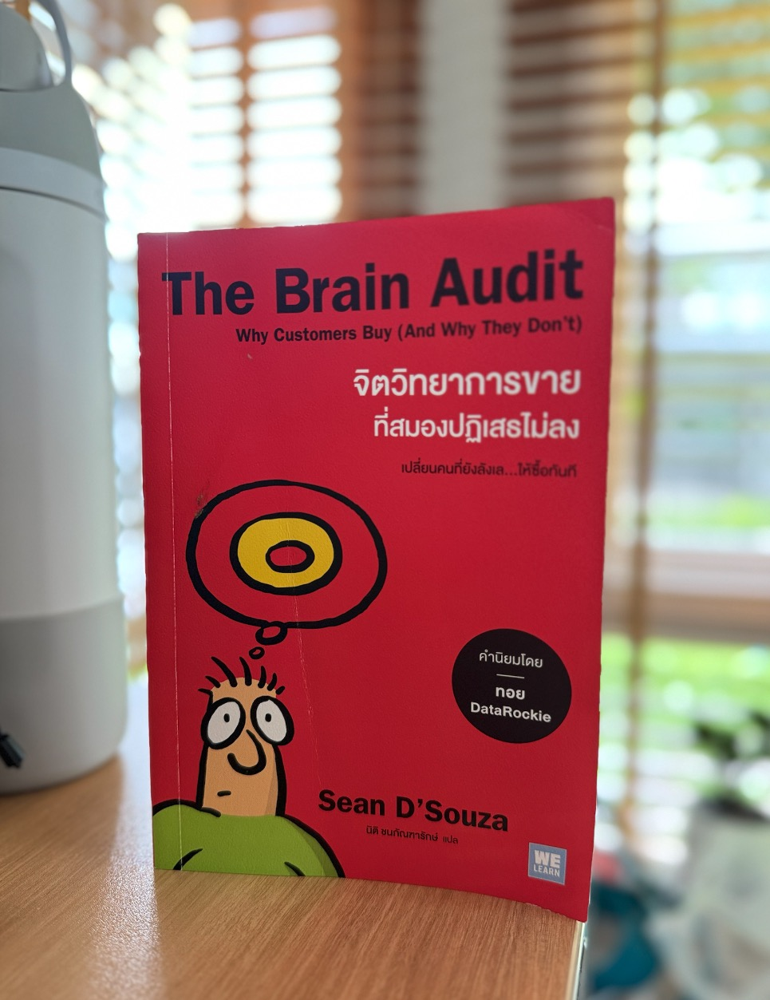
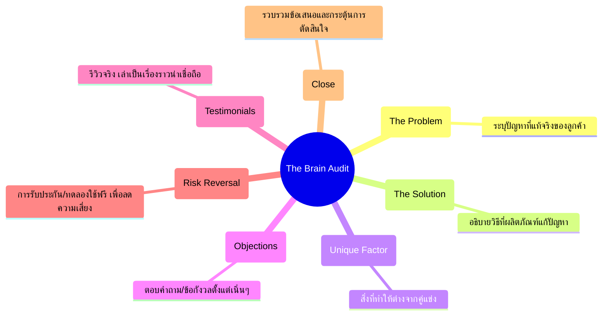

**The Brain Audit** จิตวิทยาการขายที่สมองปฎิเสธไม่ลง เปลี่ยนคนที่ยังลังเลให้ซื้อทันที

<!-- truncate -->

## สรุป The Brain Audit

### 1. แนวคิดหลัก – กระเป๋าสัมภาระ 7 ใบ (Seven Red Bags)

- การโน้มน้าวลูกค้าให้ซื้อเปรียบเหมือนเอากระเป๋าเดินทางลงจากสายพานสนามบิน
- ถ้ากระเป๋ายังไม่ครบ ลูกค้าจะยังไม่สบายใจและ **ไม่ไปไหนต่อ**
- กระเป๋าแต่ละใบ = องค์ประกอบที่ลูกค้าต้องการคำตอบ ก่อนจะตัดสินใจซื้อ

---

### 2. กระเป๋าสัมภาระ 7 ใบ (The Seven Red Bags)

#### 🎯 1. ปัญหา (The Problem)

- ลูกค้าต้องการรู้ว่าเราเข้าใจปัญหาของเขาจริง ๆ
- ถ้าไม่สะท้อนปัญหาให้ตรง เขาจะไม่สนใจ

#### ✅ 2. คำสัญญา/ทางออก (The Solution/Promise)

- แสดงให้เห็นว่าผลิตภัณฑ์/บริการของเรามีคำตอบที่ชัดเจน
- สัญญาผลลัพธ์ที่จับต้องได้ ไม่ใช่แค่คำโฆษณาลอย ๆ

#### ⭐ 3. คุณสมบัติเด่น (The Features/Unique Factor)

- อธิบายจุดแตกต่าง ว่าเราต่างจากคู่แข่งตรงไหน
- ไม่ใช่แค่บอกว่า **ดีที่สุด** แต่บอกว่า **ดีที่สุดเพราะอะไร**

#### ❓ 4. การหักล้างข้อสงสัย (The Objections)

- ลูกค้ามักมีข้อกังวล เช่น **แพงไปไหม**, **จะใช้ได้จริงเหรอ?**
- ต้องตอบ/ลบข้อกังวลเหล่านั้นตั้งแต่เนิ่น ๆ

#### 💬 5. คำรับรอง (The Testimonials)

- หลักฐานทางสังคม (Social Proof) เช่น รีวิว, เรื่องราวความสำเร็จของลูกค้า
- ต้องเป็นเรื่องเล่าจริง มีรายละเอียด ไม่ใช่คำชมลอย ๆ

#### 🛡️ 6. ความเสี่ยง (The Risk Reversal)

- ลูกค้าไม่อยากเสี่ยง ต้องทำให้เขารู้สึก **ปลอดภัย**
- เช่น การรับประกันคืนเงิน, ทดลองใช้ฟรี, หรือรับผิดชอบผลลัพธ์บางส่วน

#### 🎯 7. บทสรุป (The Summary/Close)

- รวบรวมทุกอย่างชัดเจน ตอกย้ำว่าเขาควรซื้อเดี๋ยวนี้
- ทำให้ลูกค้ารู้ว่า **นี่แหละใช่**

---

### 3. Key Insights เพิ่มเติม

- ลูกค้าซื้อด้วย **ความรู้สึก** (emotion) แต่ใช้ **เหตุผล** (logic) เพื่ออธิบายทีหลัง
- ถ้า **กระเป๋า** ยังไม่ครบ ลูกค้าจะลังเล → ไม่ซื้อ
- การขายที่ดี = ไม่ใช่การกดดัน แต่คือการ **ทำให้ลูกค้ารู้สึกมั่นใจ** ว่าตัดสินใจถูก

---

### 4. สิ่งที่ต้องโฟกัสจากหนังสือ

> **💡 หลักการสำคัญ**

- อย่าขายแค่สินค้า → ขาย **การแก้ปัญหา**
- ทำให้ลูกค้าเห็นว่าเราเข้าใจเขามากกว่าคู่แข่ง
- ตอบคำถามในใจลูกค้าทั้งหมด ก่อนเขาจะถาม

---

## The Brain Audit – 7 Red Bags (Mindmap-Style)

  
<h4>1) ปัญหา (The Problem)</h4>

  <ul>
    <li>ระบุปัญหาที่แท้จริงของลูกค้าอย่างชัดเจน</li>
  </ul>

  
<h4>2) คำสัญญา/ทางออก (The Solution)</h4>

  <ul>
    <li>อธิบายวิธีที่ผลิตภัณฑ์/บริการแก้ปัญหานั้น</li>
  </ul>

  
<h4>3) คุณสมบัติเด่น (Unique Factor)</h4>

  <ul>
    <li>สิ่งที่ทำให้ต่างจากคู่แข่ง + เหตุผลรองรับ</li>
  </ul>

  
<h4>4) การหักล้างข้อสงสัย (Objections)</h4>

  <ul>
    <li>ตอบข้อกังวลยอดฮิต เช่น ราคา การใช้งานจริง ความยุ่งยาก</li>
  </ul>

  
<h4>5) คำรับรอง (Testimonials)</h4>

  <ul>
    <li>เรื่องเล่าจริง มีบริบท/ตัวเลข ไม่ใช่คำชมลอย ๆ</li>
  </ul>

  
<h4>6) ความเสี่ยง (Risk Reversal)</h4>

  <ul>
    <li>รับประกัน/ทดลองใช้ฟรี/เงื่อนไขคืนเงิน เพื่อลดความเสี่ยงให้ลูกค้า</li>
  </ul>

  
<h4>7) บทสรุป (Close)</h4>

  <ul>
    <li>สรุปข้อเสนอชัดเจน + Call to Action</li>
  </ul>

